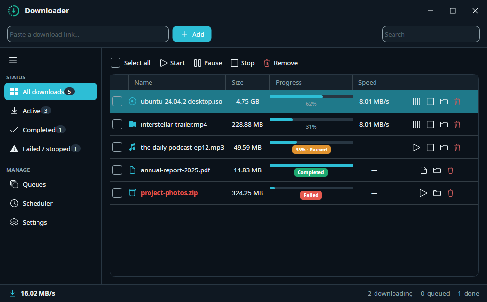
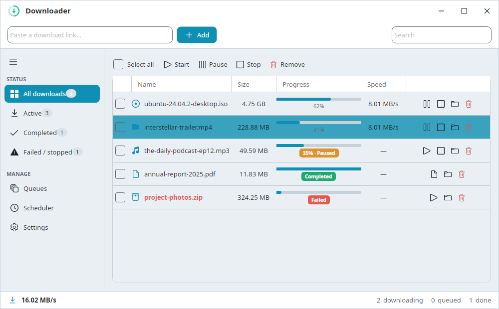
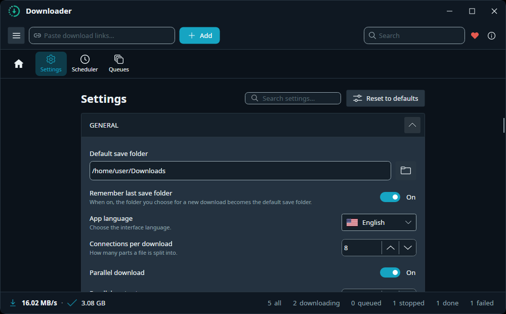

# Downloader Desktop

A fast, reliable, cross-platform **download manager** with a clean desktop UI for **Windows, macOS and Linux**. It splits each file into multiple connections for maximum speed, lets you pause and resume any time, and organizes your downloads with queues and a scheduler — all in a simple interface anyone can use.

Built with [Avalonia UI](https://avaloniaui.net/) on .NET and powered by the [Downloader](https://github.com/bezzad/downloader) engine.





## Features
- **Multi-connection downloads** — each file is split into several parts and downloaded in parallel for higher speed.
- **Pause / resume / stop** any download, any time. Incomplete downloads resume after you restart the app.
- **Add one or many links** — paste a single URL or many at once (one per line) and send them all to the same folder.
- **Automatic file names** — leave the name blank and the app detects it from the link or server.
- **Queues** — group downloads and control how many run at the same time.
- **Scheduler** — start and stop a queue automatically at set times (e.g. download overnight).
- **File-type icons** at a glance — video, audio, image, document, archive, app, disc.
- **Clear status** — live progress and speed, a friendly reason when something fails, and a details view with per-connection progress.
- **Light & dark themes** with a modern ocean-blue look.
- **Desktop notifications** when a download completes or fails (uses your OS's native notifications where available).
- **Multi-language UI** — English, فارسی (Persian), Español, Français, العربية (Arabic), Esperanto — with full right-to-left layout for Persian/Arabic. Switch under **Settings → App language**.
- **No installation, no dependencies** — fully self-contained. You do **not** need to install .NET, FFmpeg, or anything else; just download and run.
- **Your settings, your way** — sensible defaults out of the box, saved the moment you change them, with every engine option available under Settings → Advanced.



## Install
The app is **fully self-contained** — every release ships with everything it needs bundled in, so there are **no prerequisites to install** (no .NET runtime, no FFmpeg, no extra libraries).

1. Download the build for your operating system (Windows / macOS / Linux).
2. Unzip it anywhere.
3. Run the `Downloader` executable. That's it.

> The version number is shown under **Settings → About** and increases automatically with every release.

## Using the app
1. **Add a download** — paste a link into the top bar and click **Add** (or press `Ctrl+N`). In the dialog you can choose the save folder, optionally set a name, and pick a queue. To add several at once, paste multiple links (one per line).
2. **Control downloads** — each row has pause/resume/stop and, when finished, an *open-folder* button. Tick the checkboxes and use the toolbar to **Start / Pause / Stop / Remove** several at once.
3. **See details** — double-click a row to open the details window: overall progress, speed, the failure reason (if any), a live speed limit, and a per-connection progress strip.
4. **Filter** — the left sidebar filters by **All / Active / Completed / Failed**. Collapse the sidebar to icons with the ☰ button.
5. **Queues & Scheduler** — under **Manage**, create queues with a concurrency limit and schedules that run them at chosen times.
6. **Settings** — set your default save folder, connections per download, speed limit and theme; everything else lives under **Advanced**.

Your downloads list and settings are saved automatically. Config file location:
- **Linux:** `~/.config/Downloader/config.json`
- **macOS:** `~/Library/Application Support/Downloader/config.json`
- **Windows:** `%APPDATA%\Downloader\config.json`

---

## Build & run (for developers)

### Prerequisites
- **.NET 10 SDK** — https://dotnet.microsoft.com/download (verify with `dotnet --version`)
- Git

### Get the source
```shell
git clone https://github.com/bezzad/Downloader.Desktop.git
cd Downloader.Desktop/src
```
All commands below run from the `src/` folder (where `Downloader.Desktop.sln` lives).

### Run (Linux, macOS, Windows)
```shell
dotnet restore
dotnet build
dotnet run --project Downloader.Desktop/Downloader.Desktop.csproj
```

### Test
```shell
dotnet test
```

### Platform notes
- **Linux:** needs a desktop session (X11/Wayland). Running from an IDE debugger (e.g. Rider) can group the taskbar entry under the IDE host — run the built binary directly for the real taskbar icon.
- **macOS:** see the `.app` bundle steps below.
- **Windows:** an unsigned build may trigger SmartScreen — choose *More info → Run anyway* (sign builds for distribution).

### Publish a self-contained build
```shell
# Linux x64
dotnet publish Downloader.Desktop/Downloader.Desktop.csproj -c Release -r linux-x64 --self-contained true -o publish/linux-x64
# Windows x64
dotnet publish Downloader.Desktop/Downloader.Desktop.csproj -c Release -r win-x64 --self-contained true -o publish/win-x64
# macOS (Apple Silicon / Intel)
dotnet publish Downloader.Desktop/Downloader.Desktop.csproj -c Release -r osx-arm64 --self-contained true -o publish/osx-arm64
dotnet publish Downloader.Desktop/Downloader.Desktop.csproj -c Release -r osx-x64   --self-contained true -o publish/osx-x64
```
Common RIDs: `linux-x64`, `linux-arm64`, `win-x64`, `win-arm64`, `osx-x64`, `osx-arm64`. Add `-p:PublishSingleFile=true` for a single executable.

**One-command local build** (self-contained single file, no dependencies for the end user):
```shell
./scripts/publish.sh linux-x64 win-x64 osx-arm64 osx-x64   # outputs to dist/
```

**Automated releases:** pushing a `v*` tag runs `.github/workflows/release.yml`, which builds self-contained single-file executables for Windows, Linux and macOS (x64 + arm64) and attaches them to the GitHub Release — so end users just download the archive for their OS, unzip and run. `.github/workflows/dotnet-desktop.yml` builds and runs the test suite on every push/PR.

### Deploy on macOS (.app bundle)
A typical `.app` bundle:
```text
Downloader.app/
  Contents/
    Info.plist
    MacOS/Downloader (executable)
    Resources/Assets.car, downloader.icns
```
```shell
mkdir -p "Downloader.Desktop/bin/publish/osx-arm64/Downloader.app/Contents/MacOS" "Downloader.Desktop/bin/publish/osx-arm64/Downloader.app/Contents/Resources"
dotnet publish -r osx-arm64 -c Release --self-contained true -p:DebugType=None -p:DebugSymbols=false -p:PublishSingleFile=true -p:PublishTrimmed=true -p:TrimMode=link -o "Downloader.Desktop/bin/publish/osx-arm64/Downloader.app/Contents/MacOS/"
cp "Downloader.Desktop/Assets/Info.plist" "Downloader.Desktop/bin/publish/osx-arm64/Downloader.app/Contents/"
cp "Downloader.Desktop/Assets/downloader.icns" "Downloader.Desktop/bin/publish/osx-arm64/Downloader.app/Contents/Resources/"
```

**Code signing** (to distribute outside the Mac App Store) needs a Developer ID certificate:
```shell
codesign --force --options runtime --sign "Developer ID Application: Behzad Khosravifar (XXXX)" "Downloader.Desktop/bin/publish/osx-arm64/Downloader.app"
```
[Reference](https://avaloniaui.net/blog/the-definitive-guide-to-building-and-deploying-avalonia-applications-for-macos)
