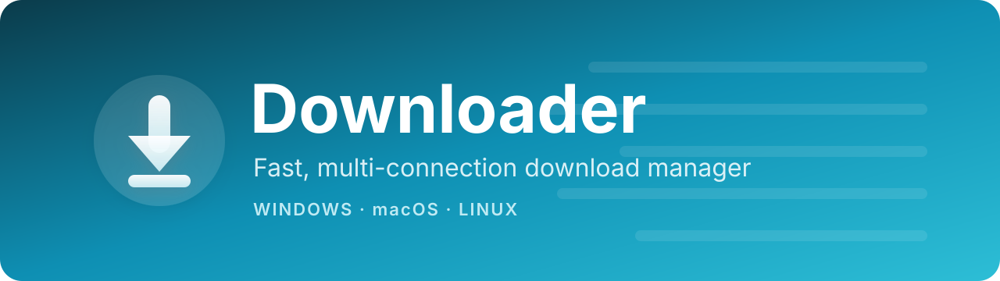
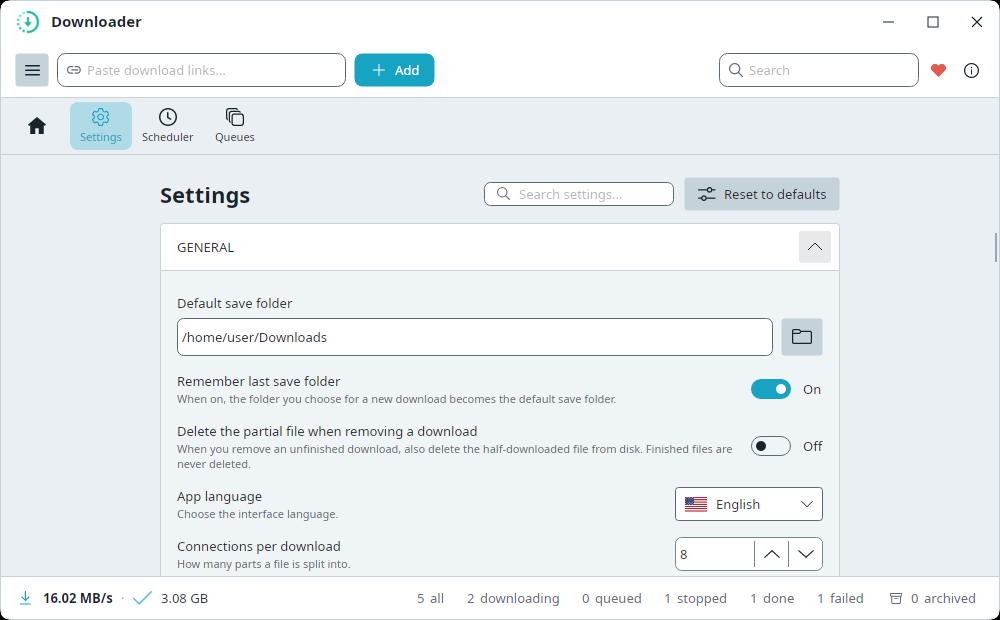

<p>
  
</p>

[)](https://github.com/bezzad/Downloader.Desktop/actions/workflows/dotnet-desktop.yml)
[](https://github.com/bezzad/Downloader.Desktop/actions/workflows/release.yml)
[](https://github.com/bezzad/Downloader.Desktop/releases)
[](https://github.com/bezzad/Downloader.Desktop/releases)
[](https://codecov.io/github/bezzad/Downloader.Desktop)
[](LICENSE)
[](https://github.com/bezzad/Downloader.Desktop/releases)

[](https://snapcraft.io/downloader)
[](https://snapcraft.io/downloader)

<a href="https://snapcraft.io/downloader">
   <picture>
      <source media="(prefers-color-scheme: dark)" srcset="https://snapcraft.io/en/dark/install.svg">
      
   </picture>
</a>

A fast, reliable, cross-platform **download manager** with a clean desktop UI for **Windows, macOS and Linux**. It splits each file into multiple connections for maximum speed, lets you pause and resume any time, and organizes your downloads with queues and a scheduler — all in a simple interface anyone can use.

Built with [Avalonia UI](https://avaloniaui.net/) on .NET and powered by the [Downloader](https://github.com/bezzad/downloader) engine.

<!-- Theme-aware: GitHub shows the dark shot in dark mode, the light shot otherwise. -->
<picture>
  <source media="(prefers-color-scheme: dark)" srcset="docs/screenshots/home-dark.png">
  
</picture>

## Features
- **Multi-connection downloads** — each file is split into several parts and downloaded in parallel for higher speed.
- **Pause / resume / stop** any download, any time. Incomplete downloads resume after you restart the app.
- **Add one or many links** — paste a single URL or many at once (one per line) and send them all to the same folder.
- **Clipboard suggestions** — copied a link? The Add dialog offers it automatically; press **Enter** to use it, or just type over it.
- **Automatic file names** — leave the name blank and the app detects it from the link or server.
- **Queues** — group downloads and control how many run at the same time.
- **Scheduler** — start and stop a queue automatically at set times (e.g. download overnight).
- **File-type icons** at a glance — video, audio, image, document, archive, app, disc.
- **Clear status** — live progress and speed, a friendly reason when something fails, and a details view with per-connection progress.
- **Light & dark themes** with a modern ocean-blue look.
- **Desktop notifications** when a download completes or fails (uses your OS's native notifications where available).
- **Dynamic Island (notch)** — an optional slim pill at the top-center of your screen showing the clock and live download speed; hover it to peek at active downloads without opening the app (Settings → Dynamic Island, off by default).
- **System tray** — closing the window keeps downloads running in the background; reopen, mute notifications, or quit from the tray menu. Optionally **launch at startup** (hidden in the tray).
- **Automatic update check** — get an in-app prompt when a new version ships, and update with one click.
- **Extensible via plugins** — a plugin can turn a link the engine can't grab directly into a real download: the app downloads all the parts and assembles them into one file for you (e.g. **HLS `.m3u8`** streams → a single playable video via the HLS plugin). Multi-part downloads show live "Part 3/10" progress and an "Assembling…" step, and resume where they left off after a restart.
- **Download Ollama models** — paste an `ollama.com` link or just type a model name like `gemma3:12b`, download it at full multi-connection speed, then click **Add to Ollama** to install it into your local Ollama in one step (checksum-verified). Ships built-in, together with the **GitHub Releases** plugin (paste `github.com/owner/repo` → get the latest release for your OS).
- **Automation-friendly** — add and manage downloads from scripts or the terminal via a local API and CLI (see [Automation](#automation-local-api--command-line)).
- **Multi-language UI** — English, فارسی (Persian), Español, Français, العربية (Arabic), Esperanto — with full right-to-left layout for Persian/Arabic. Switch under **Settings → App language**.
- **No installation, no dependencies** — fully self-contained. You do **not** need to install .NET, FFmpeg, or anything else; just download and run.
- **Your settings, your way** — sensible defaults out of the box, saved the moment you change them, with every engine option available under Settings → Advanced. Dialogs are resizable and reopen at the size you left them.

<picture>
  <source media="(prefers-color-scheme: dark)" srcset="docs/screenshots/settings-dark.png">
  
</picture>

## Install
The app is **fully self-contained** — every release ships with everything it needs bundled in, so there are **no prerequisites to install** (no .NET runtime, no FFmpeg, no extra libraries).

### Quick install

**macOS** ([Homebrew](https://brew.sh)):
```bash
brew tap bezzad/tap && brew install --cask downloader
```
This installs **Downloader.app** into your Applications folder — open it from **Launchpad**, **Spotlight** (⌘-Space → "Downloader"), or Finder like any other app.
> - Recent Homebrew versions ask you to trust a third-party tap before installing. If you see that prompt, run `brew trust bezzad/tap` (or set `HOMEBREW_NO_REQUIRE_TAP_TRUST=1`) and re-run the install.
> - The app isn't notarized yet. The Homebrew cask **removes the quarantine flag automatically on install**, so it should launch normally — you do **not** need to run `xattr` by hand. If macOS still blocks the first launch, right-click **Downloader** in Applications → **Open**, or run `xattr -dr com.apple.quarantine "/Applications/Downloader.app"`.

**Linux (Snap)** — recommended; auto-updates via the Snap Store:
```bash
sudo snap install downloader
```
> Installs from the Snap Store and keeps itself up to date automatically. If `snap` isn't available on your distro, use the install script below or [Manual download](#manual-download).

**Linux (script)** — downloads the latest release and adds a menu entry + icon:
```bash
curl -fsSL https://raw.githubusercontent.com/bezzad/Downloader.Desktop/main/scripts/install.sh | bash
```

**Debian / Ubuntu (APT)** — `apt install` + updates via `apt upgrade`:
```bash
curl -fsSL https://bezzad.github.io/Downloader.Desktop/apt/pubkey.gpg \
  | sudo gpg --dearmor -o /usr/share/keyrings/downloader.gpg
echo "deb [signed-by=/usr/share/keyrings/downloader.gpg] https://bezzad.github.io/Downloader.Desktop/apt stable main" \
  | sudo tee /etc/apt/sources.list.d/downloader.list
sudo apt update && sudo apt install downloader
```
> Or grab the `.deb` from a [release](https://github.com/bezzad/Downloader.Desktop/releases) and run `sudo apt install ./Downloader_*_amd64.deb`. See [packaging/apt](packaging/apt/README.md).

**Arch Linux** ([AUR](https://aur.archlinux.org/packages/downloader-bin)):
```bash
yay -S downloader-bin
```

**Windows** ([winget](https://learn.microsoft.com/windows/package-manager/winget/)):
```powershell
winget install bezzad.Downloader --source winget
```
This installs the portable app and puts `Downloader` on your PATH — launch it from the Start menu or a terminal. Update later with `winget upgrade bezzad.Downloader`.
> - `--source winget` is recommended: it tells winget to look only in the community package repository, which is where this app lives. Without it, winget also queries the Microsoft Store source, and if that source is unreachable it stops and asks you to pick a source instead of installing.
> - The short form `winget install downloader --source winget` also works, via the package's moniker.
> - Seeing `SSL Error: ... failed to check revocation status` or `SSL invalid CA` for the `msstore` source? That's your network or machine (a corporate TLS proxy, VPN, or a blocked certificate-revocation check), not the package — `--source winget` avoids it entirely.

**Windows (script)** — downloads the latest release, adds a Start-menu shortcut, and puts `Downloader` on your PATH. Run in PowerShell:
```powershell
iex (irm https://raw.githubusercontent.com/bezzad/Downloader.Desktop/main/scripts/install.ps1)
```

### Manual download
1. Download the build for your operating system from the [Releases](https://github.com/bezzad/Downloader.Desktop/releases) page.
2. Unpack it:
   - **macOS** — open `Downloader-osx-*.tar.gz` and drag **Downloader.app** into your **Applications** folder, then launch it from Launchpad/Spotlight.
   - **Windows / Linux** — unzip anywhere and run the `Downloader` executable. That's it.

> The version number is shown under **Settings → About** and increases automatically with every release. With **Settings → Check for updates automatically** on, the app downloads a newer release in the background, then shows an **“Update Downloader”** button at the bottom of the left menu plus a system notification. Click it (or just close the app) to install — it restarts into the new version. _Snap builds update through the Snap Store instead, so the in-app updater is disabled there._

> First launch on an unsigned build: **Windows** SmartScreen → *More info → Run anyway*; **macOS** Gatekeeper → right-click → *Open* (or `xattr -dr com.apple.quarantine <app>`).

## Using the app
1. **Add a download** — paste a link into the top bar and click **Add** (or press `Ctrl+N`). In the dialog you can choose the save folder, optionally set a name, and pick a queue. To add several at once, paste multiple links (one per line).
2. **Control downloads** — each row has pause/resume/stop and, when finished, an *open-folder* button. Tick the checkboxes and use the toolbar to **Start / Pause / Stop / Remove** several at once.
3. **See details** — double-click a row to open the details window: overall progress, speed, the failure reason (if any), a live speed limit, and a per-connection progress strip that updates live as connections come and go (press `Esc` to close).
4. **Filter** — the left sidebar filters by **All / Active / Completed / Failed**. Collapse the sidebar to icons with the ☰ button.
5. **Queues & Scheduler** — under **Manage**, create queues with a concurrency limit (only that many downloads run at once; the rest wait their turn) and schedules that run them at chosen times.
6. **Settings** — set your default save folder, connections per download, speed limit and theme; everything else lives under **Advanced**.

Your downloads list and settings are saved automatically. Config file location:
- **Linux:** `~/.config/Downloader/config.json`
- **macOS:** `~/Library/Application Support/Downloader/config.json`
- **Windows:** `%APPDATA%\Downloader\config.json`

## Plugins: download more than plain files

Plugins teach the app to turn links that aren't direct file URLs into real downloads — **just copy & paste the link**, the plugin does the rest. Download **HLS `.m3u8` video streams** as one playable file, pull **AI models straight into Ollama**, or fetch the **right GitHub release for your OS** — all at full multi-connection speed, with pause/resume and live per-part progress.

| Plugin | What it does | How it works |
| --- | --- | --- |
| **HLS video streams** | Downloads raw **HLS `.m3u8`** streams — you get one normal, playable video file. | Paste an **`.m3u8`** link. For a master playlist the plugin lets you **pick the quality**; it then downloads all the segments in parallel and assembles them into a single file. FFmpeg is fetched automatically on first use. *Optional — add it once under **Settings → Plugins → More plugins**.* |
| **Website offline copy** | Saves a **web page — or a whole site — as one `.zip`** you can read offline: pages, styles, images, scripts and fonts, with links rewired to work from disk. | Paste a page link and pick **“Offline copy (.zip)”** in the Add window. The plugin crawls the page (and same-site pages it links to), grabs everything the pages need, and packs it all into a single zip — no extra tools. *Optional — add it once under **Settings → Plugins → More plugins**.* |
| **Ollama models** | Downloads **AI models for [Ollama](https://ollama.com)** at full speed, then installs them locally in one click. | Paste an `ollama.com` model link — or just type a name like `gemma3:12b` — and download. When it finishes, click **Add to Ollama**: the model is checksum-verified and registered in your local Ollama, ready to run. *Built-in.* |
| **GitHub Releases** | Turns a **GitHub repository link** into a download of its **latest release**, picking the right asset for your operating system. | Paste `github.com/owner/repo` (no digging through the Releases page) — the plugin looks up the newest release and downloads the asset that matches your OS. *Built-in.* |

Manage plugins under **Settings → Plugins**: toggle them on/off, install optional ones with one click (downloads are checksum-verified before loading), and get an **Update** button right on the plugin when a newer version ships.

### How to write your own plugin

A plugin is just a **.NET class library** that references one tiny package — [`Downloader.Desktop.Plugins.Abstractions`](src/Downloader.Desktop.Plugins.Abstractions) — no app internals, no Avalonia. Every download flows through three phases, and your plugin hooks whichever it needs:

```
user input ──▶ RESOLVE ──▶ TRANSFER ──▶ POST-PROCESS ──▶ final file
             ILinkResolver  ITransfer    IPostProcessor
```

- **Resolve** — turn a pasted link (a page, a short-link, a repo URL…) into real download URLs. The core engine still does the downloading, so you keep multipart speed, pause/resume and progress for free. *Most plugins only need this.*
- **Transfer** — take over the byte transfer itself, only when plain HTTP can't (e.g. a torrent).
- **Post-process** — transform the finished files (mux video+audio, verify a checksum, unpack…). You can also add a one-click **action button** on completed downloads (that's how "Add to Ollama" works).

In short: implement `IDownloaderPlugin`, register your pieces in `Initialize`, build the DLL, and drop its folder into the app's `plugins/` directory — it appears in **Settings → Plugins** on the next start. The bundled [GitHub Releases plugin](src/Downloader.Desktop.Plugins/Downloader.Desktop.Plugins.GitHub) implements every interface and doubles as the reference example.

📖 **Full step-by-step guide:** [Writing a Downloader plugin](docs/writing-plugins.md) — project setup, each interface with code, packaging, and debugging tips.

## Browser extension

A companion **browser extension** (Chrome, Edge, Firefox) sends links straight to the app:

- Right-click a link/image/video/audio → **“Download with Downloader.”**
- A popup to paste a link, scan the page for links, or grab detected **video / audio / HLS (`.m3u8`)** media.
- Captured links go straight into the app and **start downloading — no dialog**. Prefer to review each link first? Untick **Add silently** in the extension popup.
- Links are sent only to the desktop app on your own machine (**Settings → Browser extension & local API**, on by default). DRM/encrypted sites like YouTube aren’t supported.

**Install** (store listings pending review — see [`src/browser-extension`](src/browser-extension)):
- _Chrome Web Store / Edge Add-ons / Firefox AMO_ — links added here once published.
- **Load it now (developer mode):** see [`src/browser-extension/README.md`](src/browser-extension/README.md) to load the unpacked extension.

## Automation: local API & command line

Other programs on your computer can add and manage downloads — handy for batch jobs and scripts
(the most-requested developer feature, [#2](https://github.com/bezzad/Downloader.Desktop/issues/2)):

```bash
# From a terminal / script: add a download (starts the app if it isn't running)
Downloader add --url https://example.com/file.zip --path ~/Downloads

# Or over the local HTTP API from any language (Node.js, Bun, Python, curl, …)
curl -X POST http://127.0.0.1:15151/api/add -d '{"url":"https://example.com/file.zip"}'
```

You can also `list` all downloads (with progress and status) and `pause / resume / cancel / retry /
remove` each one. Everything is **local-only** (loopback, never exposed to the network) and gated by
the same **Settings → Browser extension & local API** toggle, on by default. If another program is
already using port `15151`, the app automatically switches to the next port in `15151`–`15155` — the
extension and CLI find it on their own, and Settings shows the current address.

📖 **Full reference with examples:** [`docs/local-api.md`](docs/local-api.md)

---

## Reporting bugs & requesting features

Please report bugs and request features through **[GitHub Issues](https://github.com/bezzad/Downloader.Desktop/issues)** — not by Telegram or email. Issues are tracked, searchable, and handled through an automated workflow, so this is the **fastest** way to get a response (and it lets others find the same fix). Before opening one, search existing issues to avoid duplicates.

## Build from source
```shell
git clone https://github.com/bezzad/Downloader.Desktop.git
cd Downloader.Desktop/src
dotnet run --project Downloader.Desktop/Downloader.Desktop.csproj
```
Needs the [.NET 10 SDK](https://dotnet.microsoft.com/download). Full developer docs — publishing,
packaging, releasing and macOS bundling — are in [CONTRIBUTING.md](CONTRIBUTING.md).

## License
[MIT](LICENSE)
